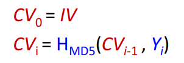
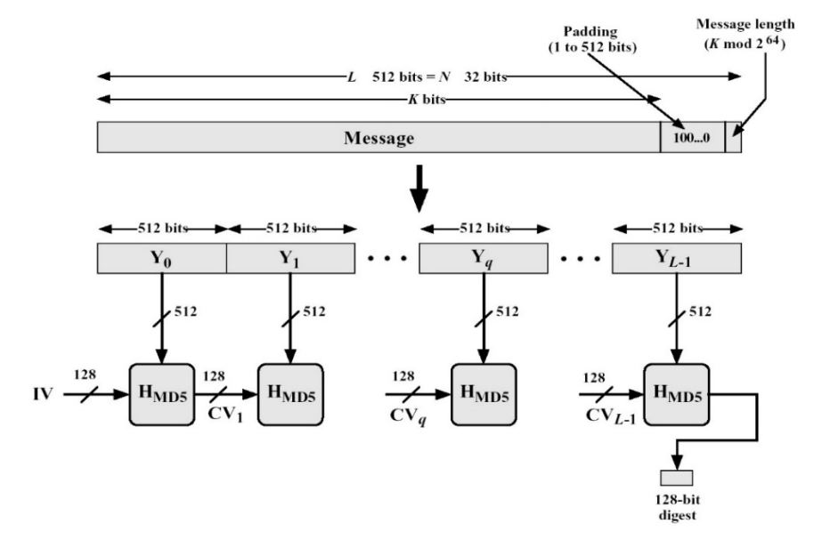
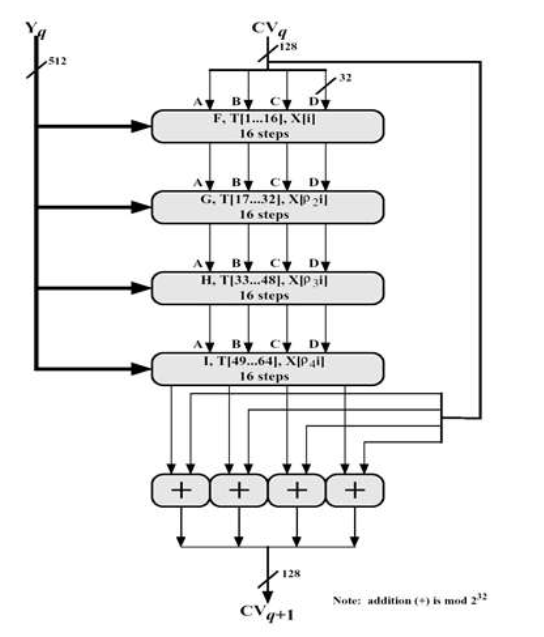
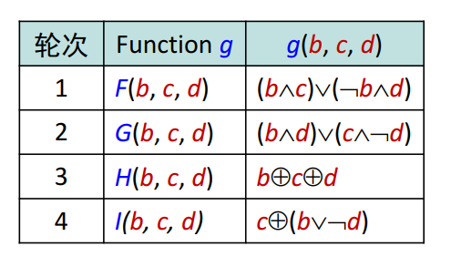
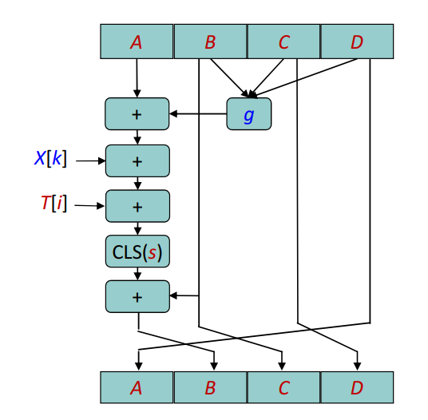

# MD5算法程序设计和实现实验报告
## （2018年秋季学期）
| 课程名称 | Web安全技术 |   任课老师   |      蔡国扬      |
| :------: | :---------: | :----------: | :--------------: |
|   年级   |    大三     | 专业（方向） |       计应       |
|   学号   |  16340015   |     姓名     |      陈彬彬      |
|   电话   | 13590883387 |    Email     | 944131226@qq.com |
| 开始日期 | 2018/12/07  |   完成日期   |    2018/12/08    |

---

## 一、算法原理概述

### 1.1 关于算法

MD5 即 Message-Digest Algorithm 5 (信息-摘要算法 5)。

MD5 算法使用小端模式设计，输入为不定长度的信息，输出为固定的128-bit的 Hash 信息摘要。

### 1.2 关于安全性

MD5 不是足够安全的。

- Hans Dobbertin 在1996年找到了两个不同的 512-bit 块,它们在 MD5 计算下产生相同的 hash 值。
- 至今还没有真正找到两个不同的消息，它们的 MD5 的 hash 值相等。

------

## 二、总体结构

### 2.1 算法输入输出

算法输入：

- 不定长度的消息字符串(string)(可包含空格)

算法输出：

- 固定128-bit的Hash信息摘要(以16进制字符串输出显示)

### 2.2 算法加密过程

- 填充

  - 原消息数据 K bits
  - 填充 P bits 的标识 ，使得 `(K+P) ≡ 448 mod 512 ，1≤P≤512`
  - 填充 64 bits 的长度信息

- 分块

  - 填充完后，可以分成 L 个 512-bit 分组：`Y[0] ，Y[1]，···，Y[L-1]  `

- 缓冲区初始化

  - 声明一个 128-bit 的 MD 缓冲区，由4 个 32-bit 的缓冲分区组成， `CV[0]，CV[1]，CV[2]，CV[3]` ，缓冲区初始状态记为 CV0。
  -  缓冲区 CV0 的 128-bit 数据的值初始为初始向量 IV。

-  HMD5循环压缩

  - 对每一个512-bit的分组，都进行循环压缩迭代，迭代在 MD 缓冲区进行，`Y[K-1]` 分组结束后的缓冲区状态记为 `CVK，K=1，2，···，L` 。

  - 对于每一个消息分组的 HMD5 循环压缩，都有 4 轮循环总共有64 次迭代运算：

    输入：

    - CV 缓冲区128-bit 数据

    - 消息分组输入 512-bit

    输出：

    - 输出 128-bit 到 CV 缓冲区，用于下一分组 HMD5 循环压缩输入的 CV 值。

  - 每一轮循环，分别固定不同的生成函数 **F，G，H，I** ，每个生成函数在该轮循环中使用16次（每轮16次迭代）。

  - 每一次迭代，结合指定的 32-bit T 表元素 t 、消息分组输入中的某个 32-bit 部分 x 和指定的 8-bit S 表元素 s 做迭代运算。

- 得出结果

  - 最后一个 512-bit 分组结束循环压缩后的缓冲区 `CVL` 即是 MD5 算法输出的 128-bit 摘要数据 。
  - 然后将这 128-bit 摘要数据转换成16进制字符串输出显示。

------

## 三、模块分解

### 3.1 填充 

#### 3.1.1 原消息数据 K bits

首先从终端读取信息字符串 message，字符串长度 len。

一个字符一字节 8-bit，因此 `K = 8 * len` 。

例子：

假如输入的消息字符串为"0123456789abcdef"

那么 K = 16*8 = 128

每8-bit一个字符，按16进制即是：（联系 ASCII 表）

```
0x30, 0x31, 0x32, 0x33, 0x34, 0x35, 0x36, 0x37,
0x38, 0x39, 0x61, 0x62, 0x63, 0x64, 0x65, 0x66
```

#### 3.1.2 填充标识 P bits

以位填充：

对 K 取 512 的模 m，结果与448进行比较：

- m < 448，P = 448-m

- m ≥ 448，P = 512+448-m

这 P bits加在原 K bits 数据后，首位的 bit 为1，其余都为0。

为了方便，我们直接以字符进行填充，转换过来相对应的就是：

对 len 取 64 的模 n，结果与56进行比较：

- n < 56，p = 56 -n
- n ≥ 56，p = 64+56-n

在原来 len 长度的数据后，加上 p 个8-bit 字符，首个字符为0x80，其余为0x00。

例子：("0123456789abcdef")

len = 16，p = 40，加上p个字符后，按16进制现在是：

```
0x30, 0x31, 0x32, 0x33, 0x34, 0x35, 0x36, 0x37,
0x38, 0x39, 0x61, 0x62, 0x63, 0x64, 0x65, 0x66, 
0x80, 0x00, 0x00, 0x00, 0x00, 0x00, 0x00, 0x00, 
0x00, 0x00, 0x00, 0x00, 0x00, 0x00, 0x00, 0x00,
0x00, 0x00, 0x00, 0x00, 0x00, 0x00, 0x00, 0x00,
0x00, 0x00, 0x00, 0x00, 0x00, 0x00, 0x00, 0x00,
0x00, 0x00, 0x00, 0x00, 0x00, 0x00, 0x00, 0x00
```

#### 3.1.3 填充长度标识 64 bits

将消息的位长度填充到最后的64bits中，注意使用小端模式

例子：("0123456789abcdef")

len = 16, K = 128 = 0x80，按16进制表示现在是：

```
0x30, 0x31, 0x32, 0x33, 0x34, 0x35, 0x36, 0x37,
0x38, 0x39, 0x61, 0x62, 0x63, 0x64, 0x65, 0x66, 
0x80, 0x00, 0x00, 0x00, 0x00, 0x00, 0x00, 0x00, 
0x00, 0x00, 0x00, 0x00, 0x00, 0x00, 0x00, 0x00,
0x00, 0x00, 0x00, 0x00, 0x00, 0x00, 0x00, 0x00,
0x00, 0x00, 0x00, 0x00, 0x00, 0x00, 0x00, 0x00,
0x00, 0x00, 0x00, 0x00, 0x00, 0x00, 0x00, 0x00,
0x80, 0x00, 0x00, 0x00, 0x00, 0x00, 0x00, 0x00
```
小端模式即是，假设K  = 0x0102030405060708，最后的8个字符(64bit)为：

```
0x08, 0x07, 0x06, 0x05, 0x04, 0x03, 0x02, 0x01
```

***

### 3.2 分块 

由3.1我们填充后得到了64L 个字符，也即 512L bits 数据。（L ≥ 1）

我们按照 32-bit 划分一个个小块M，16个小块组成一个 512-bit 的大区块Y，记作`Y[0]，Y[1]，···，Y[L-1]` 。

在源码实现中，我通过一个二维数组来实现：

```
vector<vector<bit32>> Y;
```

其中 bit32 是 `typedef` 声明的一个新类型名，原型为32-bit 的 `unsigned int` 。

***

### 3.3 缓冲区初始化

声明一个128-bit 的 MD 缓冲区，由 4 个 32-bit 的寄存器[A, B, C, D]组成，初值设为初始向量 IV，并采用小端存储。

IV初始向量 : 

A = 0x67462301，B = 0xEFCDAB89，C = 0x98BADCFE，D = 0x10325476

| | | | | |
| :---: | :---: | :---: | :---: | :---: |
| Word A | 01 | 23 | 45 | 67 |
| Word B | 89 | AB | CD | EF |
| Word C | FE | DC | BA | 98 |
| Word D | 76 | 54 | 32 | 10 |


因此 c++ 声明实现为：

```c++
// 初始向量IV
bit32 IV[4] = {0x67452301, 0xEFCDAB89, 0x98BADCFE, 0x10325476};
// 128-bit的MD缓存区，表示为4个32-bit的寄存器
bit32 CV[4] = {0x67452301, 0xEFCDAB89, 0x98BADCFE, 0x10325476};
```

***

### 3.4  HMD5循环压缩

#### 3.4.1 总流程

以 512-bit 的消息分组为单位，每一分组 `Y[q], q = 0, 1, ···, L-1` 都要经过 4 轮循环 64 次的迭代运算。表示为：



而当最后第 L 个分组 Y[L-1] 的循环压缩结束后，此时的缓冲区的 128-bit 数据即是算法的输出 128-bit 摘要数据 digest。

总流程示意图如下：



#### 3.4.2 单组流程

而分开每个单组流程来看，对于每一个 512-bit 的消息分组都要进行 4 轮共 64 次迭代运算，从单组流程整体来看，输入输出如下：

输入：

- 当前缓冲区的 CV 128 bits 数据。

- 对应的消息分组 512 bits 数据。

输出：

- 用于下一轮的缓冲区 CV 128 bits 数据

4 轮循环，每一轮按顺序使用到固定的不同的生成函数 **F，G，H，I** ，每个生成函数使用一轮 16 次。每次迭代运算都会改变寄存器A, B, C, D 共128-bit 的数据。

单组流程的示意图如下：



其中 A, B, C, D 是缓冲区 128-bit 分成的 4个 32-bit 寄存器。

每次迭代中：

T[i] 是迭代运算中使用到的 T表中的元素数据，32 bits。

X[j] 是迭代运算中使用到的原来消息分组的某个部分， 32bits。

单次迭代还需要用到一个 S 表中的元素作为循环左移位数 s。

具体 T[i]，X[j]，s的选取，取决于轮数和该轮中的迭代次。

最后结束 4 轮 64 次迭代运算后，当前的 A、B、C、D 寄存器缓存 128-bit 和 初始输入时 CV 分成的 4*32 bits 做加运算 （mod32加）。（图中展示得更详细准确）


##### 3.4.2.1 生成函数 F, G, H, I

生成函数 **F, G, H, I** 是固定的，每轮用一个，其定义如下：



也即 4轮循环 64 次迭代中，先用 F 函数 16 次，然后 G 函数 16 次， 然后 H 函数 16 次，然后 I 函数 16 次。

其中b, c, d是当前寄存器缓存的数据，各 32 bits。


##### 3.4.2.2 T表 T[i] 元素的选取

T表是一个固定的有 64 个 32-bit 数据的表，根据在该分组压缩循环中的迭代次数，选取对应下标的 T表元素。

T表如下：`T[1] ~ T[64]` 

```
0xd76aa478, 0xe8c7b756, 0x242070db, 0xc1bdceee, 
0xf57c0faf, 0x4787c62a, 0xa8304613, 0xfd469501, 
0x698098d8, 0x8b44f7af, 0xffff5bb1, 0x895cd7be,
0x6b901122, 0xfd987193, 0xa679438e, 0x49b40821, 
0xf61e2562, 0xc040b340, 0x265e5a51, 0xe9b6c7aa, 
0xd62f105d, 0x02441453, 0xd8a1e681, 0xe7d3fbc8,
0x21e1cde6, 0xc33707d6, 0xf4d50d87, 0x455a14ed, 
0xa9e3e905, 0xfcefa3f8, 0x676f02d9, 0x8d2a4c8a, 
0xfffa3942, 0x8771f681, 0x6d9d6122, 0xfde5380c,
0xa4beea44, 0x4bdecfa9, 0xf6bb4b60, 0xbebfbc70, 
0x289b7ec6, 0xeaa127fa, 0xd4ef3085, 0x04881d05, 
0xd9d4d039, 0xe6db99e5, 0x1fa27cf8, 0xc4ac5665,
0xf4292244, 0x432aff97, 0xab9423a7, 0xfc93a039, 
0x655b59c3, 0x8f0ccc92, 0xffeff47d, 0x85845dd1, 
0x6fa87e4f, 0xfe2ce6e0, 0xa3014314, 0x4e0811a1,
0xf7537e82, 0xbd3af235, 0x2ad7d2bb, 0xeb86d391
```

例子：

假设当前是第 2 轮的第 5 次迭代，那么迭代数就是 `i = 16+5=21`

应该选取的 `T[i]` 元素为：`T[i] = 0xd62f105d` 。


##### 3.4.2.3 分块数据 X[i] 的选取

`X` 是整个输入的 512-bit 消息分组数据，而对于不同次数的迭代运算，我们只选取 `X` 中不同的 32-bit 的部分，它选取的规则如下：

第 i 次迭代 (`i=1, 2,···, 64`) 使用的 `X[k]` 的确定：

设 `j = i -1`：

第1轮迭代：`k=j`.

第2轮迭代：`k=(1 + 5*j) mod 16`.

第3轮迭代：`k=(5 + 3*j) mod 16`.

第4轮迭代：`k=(7*j) mod 16`.

如果不想计算迭代次数，也可以直接用下面的结果表：

顺序使用：(答案是一样的)

`X[0, 1, 2, 3, 4, 5, 6, 7, 8, 9, 10, 11, 12, 13, 14, 15]`

`X[1, 6, 11, 0, 5, 10, 15, 4, 9, 14, 3, 8, 13, 2, 7, 12]`

`X[5, 8, 11, 14, 1, 4, 7, 10, 13, 0, 3, 6, 9, 12, 15, 2]`

`X[0, 7, 14, 5, 12, 3, 10, 1, 8, 15, 6, 13, 4, 11, 2, 9]` 

例子：

假设当前是第 2 轮的第 5 次迭代，那么 `i = 16+5 = 21`，`j = 20`

那么 `k = (1+5*20) mod 16 = 5` ，应该选取的分块数据 `X[k] = X[5]`

另一种方法通过查表法，也可以知道第二轮的第五次迭代为 `X[5]`。


##### 3.4.2.4 左循环移位数 s 的选取

各次迭代运算采用的左循环移位的 s 值按照 S 表选取：

S 表如下，`S[1]~S[64]`

```
7, 12, 17, 22, 7, 12, 17, 22, 7, 12, 17, 22, 7, 12, 17, 22,
5, 9,  14, 20, 5, 9,  14, 20, 5, 9,  14, 20, 5, 9,  14, 20,
4, 11, 16, 23, 4, 11, 16, 23, 4, 11, 16, 23, 4, 11, 16, 23,
6, 10, 15, 21, 6, 10, 15, 21, 6, 10, 15, 21, 6, 10, 15, 21
```

例子：

假设当前是第 2 轮的第 5 次迭代，那么迭代数就是 `i = 16+5=21`

选取的左循环移位数 `s = 5`

#### 3.4.3 单次迭代流程

单次迭代的输入输出如下：

输入：

- a, b, c, d 缓冲区当前的 4*32 bits 数据
- g 是生成函数计算出的 g(b, c, d) 的 32 bits 数据。
- x 是选取的分块数据 X[i]，32 bits。
- t 是T表选取的 T[i] 元素， 32 bits。
- s 是S表选取的左循环位移数，8 bits。

输出：

- a, b, c, d 单次迭代运算结束后的 A, B, C, D寄存器的 4*32 bits的数据，用于下次迭代运算。

迭代运算流程：

- 重新计算 寄存器 A 的数据

  `a <- b + ((a+g+x+t) <<< s)` 

- 缓冲区 (A, B, C, D) 作循环轮换

  `(B，C, D, A) <- (A, B, C, D)` 

  也即：

  ```
  A = d;
  B = a;
  C = b;
  D = c;
  ```

单次迭代流程图如下：（更好地理解缓冲区的循环轮换）




***

### 3.5 得出结果

当结束最后一个消息分组的 4 轮 64 次迭代运算后，此时缓冲区 CV的 128 bit 数据就是 MD5 算法的128-bit 摘要数据 。

然后我们要将这 128-bit 摘要数据依据小端模式转换成16进制字符串输出显示。

------

## 四、数据结构

- **main.cpp**：主函数，测试函数。

  负责从终端读取消息字符串，调用 MD5算法得到要输出显示的16进制摘要字符串，显示到终端。

- **MD5.hpp** ：算法主实现

  public: 

  - 主函数，输入消息字符串，返回16进制 HASH 摘要字符串

    ```c++
    string getMD5Digest(string message)；
    ```

  private:

  - 私有成员：

    ```c++
    // 初始向量IV
    bit32 IV[4] = {0x67452301, 0xEFCDAB89, 0x98BADCFE, 0x10325476};
    // 128-bit的MD缓存区，表示为4个32-bit的寄存器
    bit32 CV[4] = {0x67452301, 0xEFCDAB89, 0x98BADCFE, 0x10325476};
    
    // 填充操作的padding_len个8-bit数据分组
    int padding_len; // padding_len = 64n
    vector<bit8> paddingMessage;
    
    // 分块操作的N个32-bit分组
    // 也是L个512-bit区块分组, L = N * 16
    int N;
    int L;
    vector<vector<bit32>> Y;
    ```

  - 填充操作函数，将消息字符串按 MD5 规则填充到 512-bit 的整数倍，暂时按照 8-bit 字符存储到数组 `vector<bit8> paddingMessage`。

    ```c++
    // 将输入message字符串padding拓展，并按8-bit写成数组分组
    void padding(string message);
    ```

  - 分块操作函数，将拓展的8-bit 数组分块写入二维数组 `vector<vector<bit32>> Y` 中

    ```c++
    // 将拓展后的8-bit分组进行分块操作
    // 每个分块512-bit
    void blocking()；
    ```

  - 循环压缩操作函数

    ```c++
    // MD5压缩函数HMD5
    // 对每个区块分组经过4轮循环(共64次迭代)的压缩算法
    void HMD5()；
    ```

  - 轮生成函数 **F, G, H, I**

    ```c++
    bit32 F(bit32 b, bit32 c, bit32 d);
    bit32 G(bit32 b, bit32 c, bit32 d);
    bit32 H(bit32 b, bit32 c, bit32 d);
    bit32 I(bit32 b, bit32 c, bit32 d);
    ```

  -  辅助函数，循环左移函数

    ```c++
    // 循环左移函数,将32-bit input循环左移s位
    bit32 leftShitf(bit32 input, bit8 s);
    ```

  -  将 CV 128-bit 数据转成 16进制显示的字符串函数

    ```c++
    // 拼接4*32bit共128bit的CV块转化成字符串返回
    // 输出结果用16进制表示,用sstream实现字符串流转成16进制显示字符串
    // 注意小端模式
    string getDigest(); 
    ```


- **Table.hpp** ：表格数据及自定义类型

  ```c++
  // 32-bit数据
  typedef unsigned int bit32;
  // 8-bit数据
  typedef unsigned char bit8;
  // T表(one-based),共64个元素T[1]~T[64]，各次迭代采用的加法常数T值
  bit32 T[65] = {/*TODO*/}
  // s表(one-based)，共64个元素s[1]~s[64]，各次迭代运算采用的左循环移位的s值
  bit8 S[65] = {/*TODO*/}
  ```

  

------

## 五、C++语言源代码

- 源码已经在上传作业包下的 **src** 文件夹内
- 或者查看[我的github项目](https://github.com/SYSUcarey/MD5)  

------

## 六、编译运行结果


终端运行：（Ubuntu 18.04）

```bash
$ g++ main.cpp -o main
$ ./main

```


